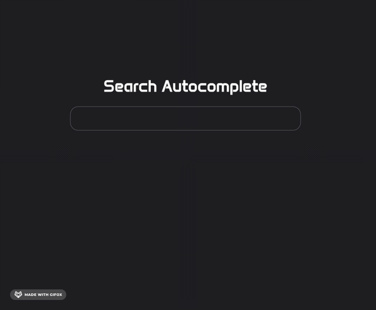
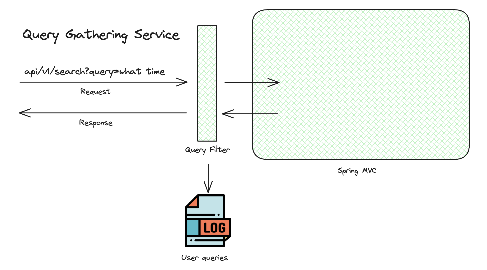
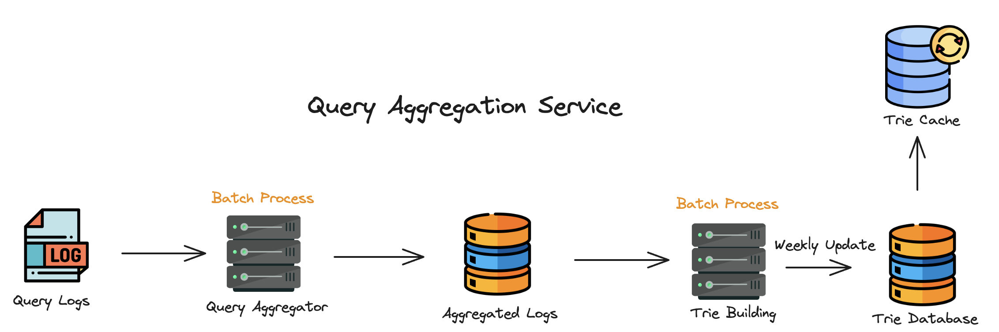
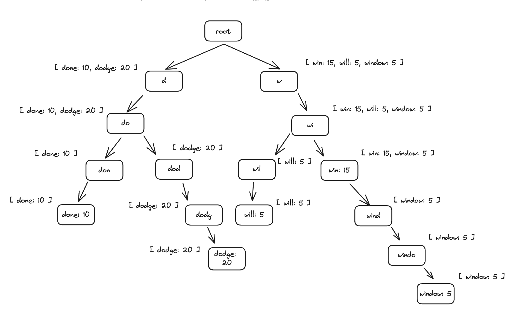

# Search Autocomplete System

Implemented a scalable search autocomplete system optimized for suggesting top five queries to users in constant time.

## System Overview

The search autocomplete system is powered by a Trie (prefix tree) data structure, complemented by an integrated 
caching mechanism. This caching feature efficiently stores and retrieves the top five most relevant query suggestions in response 
to user input, thereby substantially improving query suggestion response times. Additionally, user-submitted queries are aggregated 
and incorporated into the pool of suggestions on a weekly basis, ensuring a dynamic system that continuously provides relevant query 
suggestions.

## System Design
Developed the application with system design principles in mind, ensuring a reliable system that is able to scale as user traffic increases.

### Query Gathering Service
User queries undergo logging and preservation within log files. Prior to preservation, each query request is intercepted 
by a custom filter, ensuring input validation measures are met.

### Query Aggregation Service
User submitted queries are aggregated to permanent storage once per week through the use of **batch processing**. The pool of available suggestions is 
updated every week, enabling dynamic query suggestions based on user searches. Furthermore, weekly updates stop the constant
rebuilding of the Trie structure used to generate query suggestions, resulting in faster query suggestions.

### Trie (Prefix Tree) Structure
The underlying data structure behind the search autocomplete system is the Trie (prefix tree) data structure.
Its operations allow for fast insertion and retrieval of queries with a common prefix, effectively satisfying the requirements of the search
autocomplete system. Query suggestions response time is further improved with the addition of a custom cache mechanism that 
stores the top five most promising query suggestions.

##### Trie Structure Without Caching Mechanism
Time complexity: O(p) + O(c) + O(clogc)
- Find the query prefix: O(p)
- Traverse the subtree from the prefix node to get all valid children: O(c)
- Sort the children and get top k queries: O(clogc)

##### Trie Structure With Caching Mechanism
Time complexity: O(1)
- Find query prefix: O(1)
  - Users rarely search long queries, therefore limiting its length helps improve time complexity.
- The cache mechanism rules out the need to traverse the subtree from the prefix node: O(1)
- The caching mechanism already contains the top k queries with the given prefix, therefore no sorting is needed: O(1)

## Technologies
- Java
- Spring Boot
- Batch Processing
- MongoDB
- Redis Cache
- React JS
- REST API Rate Limiting

